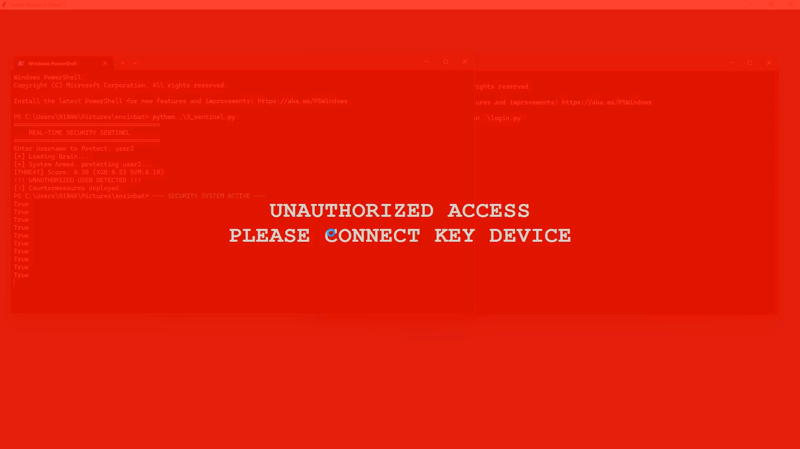
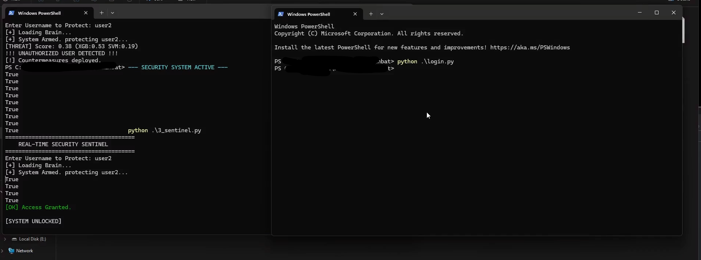

# Keyboard Biometrics Security System

## System Overview
This system uses AI/ML to authenticate users based on their unique typing patterns (keystroke dynamics). It consists of three main components:

### Files:
1. **1_data_collector.py** - Collects keystroke timing data
2. **2_model_builder.py** - Trains AI models on collected data
3. **3_sentinel.py** - Real-time monitoring and threat detection
4. **enx.bat** - Security countermeasure script





## How to Use:

### Step 1: Collect Training Data
```powershell
python 1_data_collector.py
```
- Enter your username when prompted
- Type naturally for 2-5 minutes (at least 200-300 keystrokes)
- Press ESC when done
- Data saved in `user_data/<username>_raw.csv`

### Step 2: Build Your AI Model
```powershell
python 2_model_builder.py
```
- Enter the same username
- The system will train 3 AI models (XGBoost, SVM, HMM)
- Model saved in `models/<username>_brain.pkl`

### Step 3: Activate Protection
```powershell
python 3_sentinel.py
```
- Enter your username
- System monitors your typing in real-time
- If someone else types, it triggers `enx.bat` security response


## Security Note:
The `enx.bat` file creates popup alerts when unauthorized access is detected. Customize it for your specific security needs
